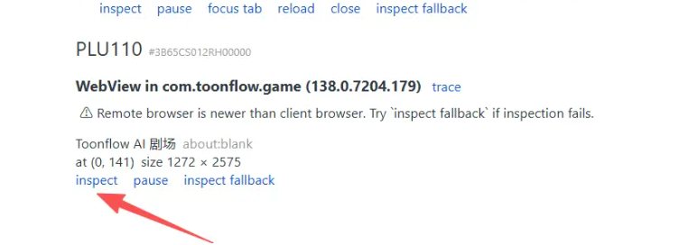

Android 系统中，每个 App 的 WebView 都需要在代码中单独调用 WebView.setWebContentsDebuggingEnabled(true) 才能被检测到
# Chrome 远程调试安卓h5
`chrome://inspect/#devices`
然后点击inspect 或者 inspect fallback


## 没有看见inspect？
没有看见设备？等个几分钟再说

原因：很有可能是设备被占用了。例如android studio 和Chrome DevTools 互相占用
解除占用：
1. 重启 ADB 服务（最有效）
   这是解决设备不显示问题的第一选择：
```
adb kill-server
adb start-server
adb devices
```

刷新chrome://inspect/#devices页面

2.手机的仅充电<->传输 ,有问题就换成另一个模式。
直到device
(base) PS C:\Users\viaco> adb devices
List of devices attached
3B65CS012RH00000        device
emulator-5554   device

3.chrome://inspect/#devices 
没有看见设备？等个几分钟再说

## 尺寸查看(chrome://inspect/#devices)
### 一加手机turbe 6
#### 手机的真实尺寸是
物理像素（硬件屏幕，）
宽：1272 px
高：2772 px
横向是宽 1272，纵向高度 2772，1.5K AMOLED 屏幕，这是屏幕硬件真实像素点数量一加手机
#### h5app 等webview 是
html:363.429x792.000
插件iframe:363.429x752.000

### 这个尺寸变小了？
是webview 的问题，还是web 项目的问题，还是其他机制的问题？

不是配置问题，是 viewport meta + CSS 像素 vs 物理像素的换算机制问题。

三层机制差异

1. 物理 vs CSS 像素

一加 turbo 6 (真机):
  物理分辨率:1272 x 2800 px
  DPR: 3
  CSS 分辨率:  424 x 933 css px    ← 浏览器看到的"逻辑分辨率"
  ← 你 Chrome 模拟器填的 "584 x 1272" 是物理分辨率

Chrome devtools "OnePlus Turbo 6" (模拟):
  填的 "584 x 1272" → 这是设备物理分辨率
  浏览器 viewport: 584/3 = 194 css px 宽   ← 这是浏览器内部用的尺寸

2. 真机 WebView（微信 / 安卓 app）

WebView 启动 → Android 给它屏幕的"逻辑尺寸"
例如411 x 891 css px (Pixel 6 之类的常见值)
↓
WebView 内部 window.innerHeight = 891
↓
iframe 占 flex 容器的高 → 最大可用 ~750-820px
↓
我们的 @media (max-height: 600px) 不触发 → 完整版 ✓

3. Chrome桌面浏览器 + devtools 模拟手机

1. 你浏览器窗口总高 ~900px
2. Chrome devtools 顶栏占了 ~150px
3. 地址栏/书签栏占了 ~100px
4. devtools 视图区域只剩 ~650px
5. devtools "Responsive" 模式 → 把视图区域映射成模拟设备的 CSS 高度
6. 如果 "OnePlus Turbo 6584x1272" + DPR=3 → 物理 1272/3 = 424 css px 高
7. 但 devtools 视图区域映射默认会"装下整个设备"
8. 你的窗口实际只能装下 ~650px物理 → 模拟出的 iframe高度可能就是 600-700px
↓
命中 @media (max-height: 600px) → 缩放版

核心问题

不是 chrome 配错，是 Chrome devtools 在小窗口下"勉强装下"模拟设备时，会自动按比例缩小整个视图，iframe 的 innerHeight 也跟着缩小。

而真机 WebView 是直接拿到屏幕的 CSS 像素，跟浏览器外壳大小无关。

三种调试体验对比

┌───────────────────────────────────┬────────────────────┬───────────┐
│               环境                │ iframe innerHeight │   表现    │
├───────────────────────────────────┼────────────────────┼───────────┤
│ 真机 WebView（微信/安卓 app）     │ 752px              │ 完整版 ✓  │
├───────────────────────────────────┼────────────────────┼───────────┤
│ Chrome devtools 默认 "Responsive" │ ~500-650px         │ 缩放版 ⚠️ │
├───────────────────────────────────┼────────────────────┼───────────┤
│ Chrome devtools "Edit" 模式       │ 由你设的尺寸决定   │ 看怎么设  │
└───────────────────────────────────┴────────────────────┴───────────┘

推荐调试姿势

要"模拟真机"看完整版，需要在 devtools 里：

1. 用 Chrome 直接打开 http://localhost:5175/ → 按 F12 → 点设备图标 → 选 "Responsive"
2. 手动拉宽 devtools 视图区域到 ≥ 850px（让设备 CSS 高度 ≥ 600）
3. 或者选 Edit... 设成 411×915（Pixel 7 的 CSS 尺寸，不是物理分辨率）

关键：填到 device dimensions 里的数字要看清楚是物理还是 CSS 像素——填 CSS 像素更接近真机。

## 其他问题？
自己研究吧！