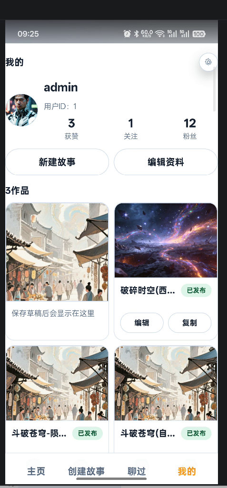
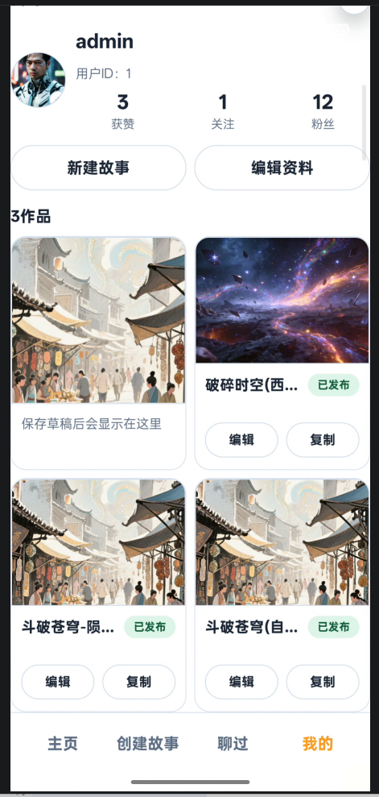

# h5 界面划分
### 状态栏 手机自带的。app 需要让位的空间-固定位置。
h5-app 传入状态栏高度，用于让位
### 顶部-固定区域
### 中部-滚动区域
### 底部-固定区域


```
/* 安卓模式下给页面容器的第一个section 加 padding-top（只加顶部，底部由 .nav 处理） */
body.android-device {
  padding-top: 0px;
}
body.android-device .my-page,
body.android-device .main-view > section:not(.play-page):not(.home-stage) {
  position: relative;
  margin-top: var(--android-inset-top);
}
body.android-device .settings-header {
    margin-top: var(--android-inset-top);
}

body.android-device .modal-panel.fullscreen {
  height: calc(100vh - 24px - var(--android-inset-top));
}
body.android-device .home-stage {
  padding-top: var(--android-inset-top);
}

body.android-device .play-page .play-stage{
  padding-top: var(--android-inset-top);
}

/* 新增伪元素样式 */
body.android-device .my-page::before,body.android-device .settings-page::before,
body.android-device .main-view > section:not(.play-page):not(.home-stage)::before {
  content: "";
  position: absolute;
  top: calc(-1 * var(--android-inset-top)); /* 向上偏移等于margin-top的值 */
  left: 0;
  right: 0;
  height: var(--android-inset-top); /* 高度等于margin-top */
    background-image: linear-gradient(
    rgba(0, 0, 0, 0.7),  /* 顶部色（深半透明） */
    rgba(0, 0, 0, 0.3)    /* 底部色（接近完全透明） */
  );
  z-index: 1;
}

/* 安卓模式下顶部按钮下移 */
body.android-device .home-global-actions {
  top: calc(12px + var(--android-inset-top));
}

body.android-device .play-header {
  padding-top: calc(8px + var(--android-inset-top));
}

body.android-device .play-global-actions {
  top: calc(8px + var(--android-inset-top));
}


body.android-device .nav {
  padding-bottom: calc(12px + var(--android-inset-bottom, 0px));
}
```

# 问题分析
例如底部位置不够固定
正常情况：


往上拖动后：


## 状态栏 遮蔽区域
body.android-device .my-page::before,body.android-device .settings-page::before,
body.android-device .main-view > section:not(.play-page):not(.home-stage)::before
被挤出界面了

## 底部-固定区域  被拉高

## 顶部-固定区域  被挤出界面了

### 中部-滚动区域
明显的现在是整个界面都算在滚动区域
