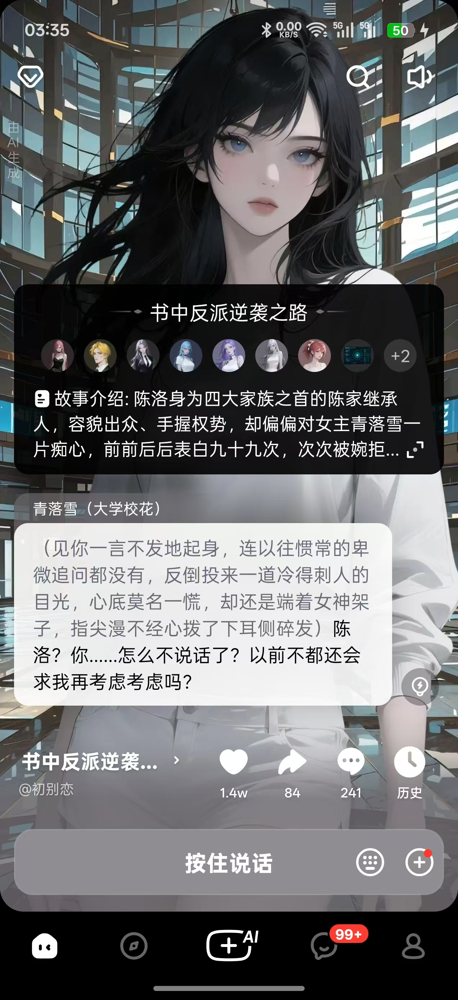
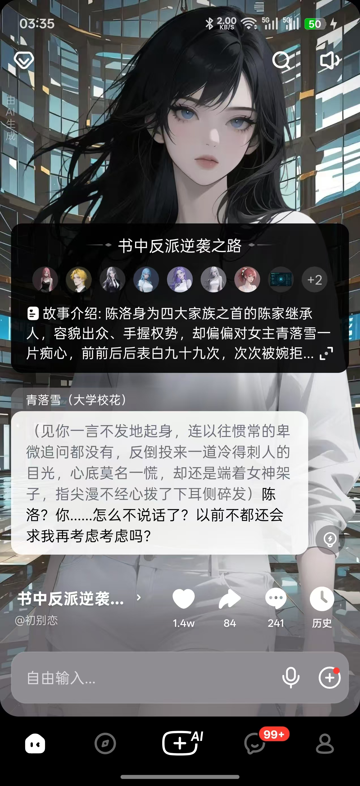
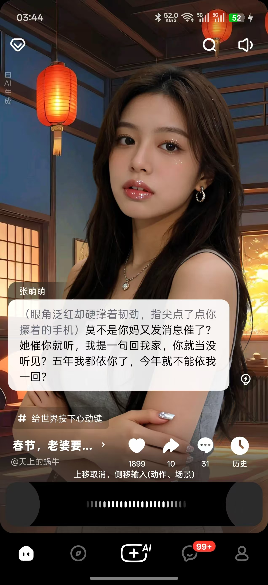

# @no_modify

 
# h5安卓app
h5安卓app  改成这个样子吧语音输入模式，文字输入模式, 语音模式  按住就可以录音释放就发送 上滑取消。 侧移就就是动作 意思是“(xxxx)”
挂号包住输入的语音内容。何为侧移左滑右滑一定具体就会切换台词/动作，释放按住就是发送。 

## 文字输入模式：
[输入框] [语音切换按钮（奥森）][+号，点击暂时是发送图片的功能]
这个时候enter 键就是发送的意思

## 语音输入模式：
[按住说话] [键盘切换按钮（奥森）][+号，点击暂时是发送图片的功能]
[按住说话] 这个时候按钮是白灰色的 效果。 

### [按住说话] 按住后 进入录音中模式
按住”[按住说话]“按钮后

#### 显示
文字（操作框上方）：上移取消，侧移输入(动作、场景)
操作框（[按住说话] 的那个位置）：这个框是黑色的，持续按住会有录音中效果。操作框占一行。隐藏：[按住说话][键盘切换按钮（奥森）][+号，点击暂时是发送图片的功能] 这三个按钮。
#### 业务
- 按住”[按住说话]“按钮后
操作框（[按住说话] 的那个位置）：这个框是黑色的，持续按住会有录音中效果。
这个是时候是台词语音输入模式
- 上滑就是取消回到“语音输入模式”
- 左右移动进入动作输入模式，假设按住向右移动一定距离。这个时候是这个框变成白色的持续按住会有录音中效果。
文字（操作框上方）：上移取消，侧移输入(台词)
- 按住向右移动一定距离回去台词语音输入模式。这个框变回黑色的。
文字（操作框上方）：上移取消，侧移输入(动作、场景)
这个时候按住向左移动一定距离会进入动作输入模式，这个框变成白色。
- 简单来说在中间就是就是台词输入模式。

- 按住”[按住说话]“按钮（实际是操作框） 被释放后发送用户台词
回到：语音输入模式 这个模式。
# 网页端
网页端依然保留原来的交互逻辑不要使用使用按住 释放这套操作业务逻辑

# 实现
现在h5 页面做安卓h5app 对应的ui 
然后安卓h5ap 通过JSBridge  在“调试” “继玩” “游玩” 时替换显示为“安卓h5app” 的那套ui(web页面里做好！！)

http://localhost:5173/?device=mobile
也能进入“安卓h5app” 的显示模式

解决无法开始录音：permission denied 的问题